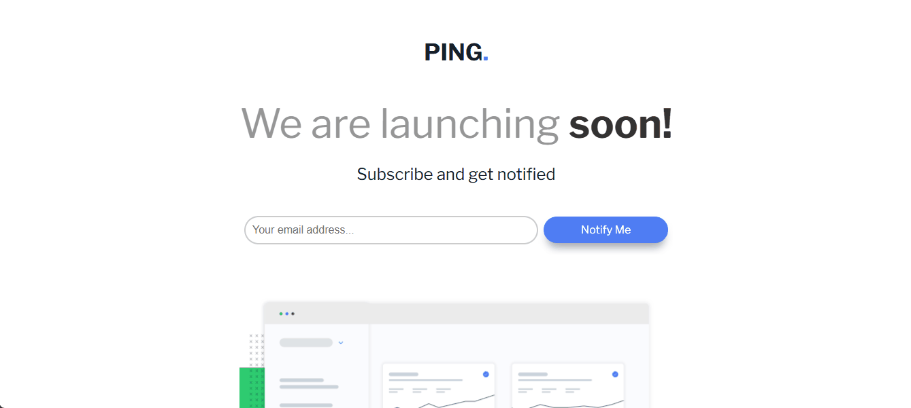
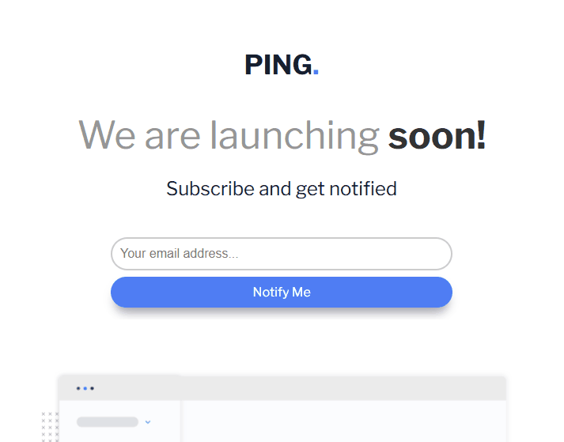

# Frontend Mentor - Ping coming soon page solution

Esta é uma solução para o [Ping coming soon page challenge on Frontend Mentor](https://www.frontendmentor.io/challenges/ping-single-column-coming-soon-page-5cadd051fec04111f7b848da). Os desafios do Frontend Mentor ajudam você a melhorar suas habilidades de codificação construindo projetos realistas.
### Screenshot





### Link

- URL do site ativo: [link aqui](https://andersonf-dev.github.io/ping-coming-soon-page/)

# Trecho de código usado js
```js
 return (<>
    <InputWrapper>
      <div className="input-container">
        <StyledInput
          type="email"
          value={email}
          onChange={handleChange}
          isValid={isValid}
          placeholder="Your email address..."
        />
      {!isValid && <ErrorMessageMobile>Please provide a valid email address</ErrorMessageMobile>}
        <Button onClick={handleSubmit}>Notify Me</Button>
      </div>
    </InputWrapper>
      {!isValid && <ErrorMessage>Please provide a valid email address</ErrorMessage>}
    </>
  );

```
### Criado com
- Marcação HTML5 semântica
- Propriedades personalizadas CSS
- Flexbox
- React
- styled-components
- JavaScript

### O que aprendi

- Aprendi a criar um card, posicionar elementos na tela, centralizar, criar e estilizar projetos em React.
- O tilezei o styled-components para fazer a estilização do projeto. 
- Criar uma validação para o input.
- Exibir uma mensagem de erro quando o usuário coloca um Email invalido

### Desenvolvimento contínuo

Este é apenas mais um de muitos dos projetos de front end que fiz alem de CSS, HTML, JavaScript agora tambêm estou me desenvolvendo em React. Continuarei fazendo e me desenvolvendo ainda mais. Estou aprendendo cada dia mais, fazendo esses desafios, 